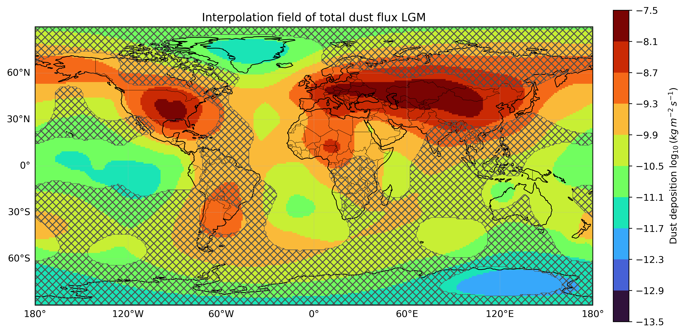
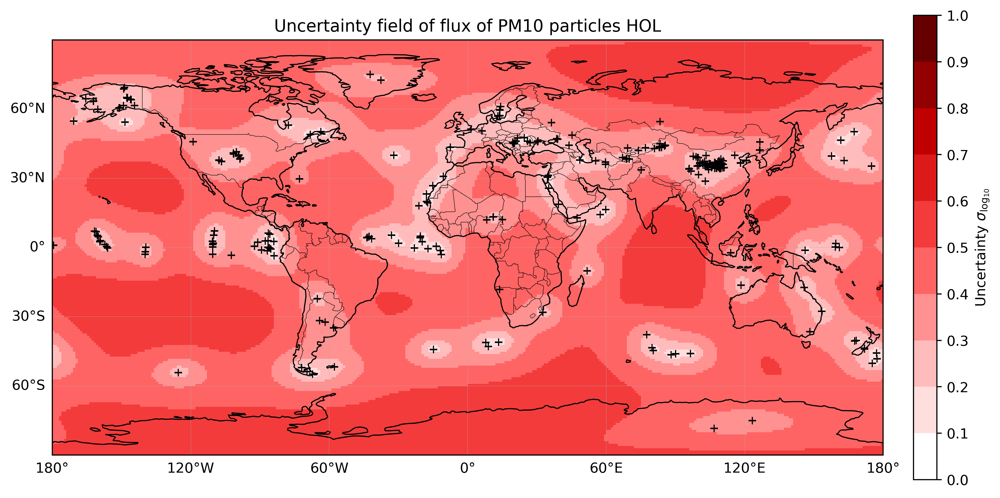

# PaleoDust Global Dust Flux Analysis

This repository contains a Python-based workflow for analyzing global dust deposition fields for the Holocene (HOL) and Last Glacial Maximum (LGM). It includes site-level PaleoDust records, gridded CSV matrices, NetCDF products, uncertainty maps, and summary results for 1°, 2°, and 5° spatial grids.

## Repository structure

```text
PaleoDust-global-dust/
├── Code/
│   ├── brain.py                 # Computes global fluxes and generates maps
│   ├── create.py                # Converts gridded CSV fields to NetCDF
│   └── PaleoDust_Clusters.py    # Builds spatial clusters from point records
├── Data/
│   ├── main/                    # Original HOL and LGM point datasets
│   └── by_grid/
│       ├── 1degree/             # CSV, NetCDF and result files
│       ├── 2degree/
│       └── 5degree/
├── Figures/
│   ├── 1degree/
│   ├── 2degree/
│   └── 5degree/
├── Results/                     # Plain-text summaries by grid resolution
├── requirements.txt
└── README.md
```

## Data included

- **Point datasets:** `main_HOL.txt` and `main_LGM.txt`.
- **Gridded CSV fields:** interpolated flux (`IF`) and 1-sigma uncertainty (`1S`) fields.
- **NetCDF files:** individual files for HOL/LGM and bulk/PM10 fluxes, plus combined `PaleoDust_all.nc` files.
- **Figures:** interpolation and uncertainty maps for total dust flux and PM10 particles.
- **Results:** integrated fluxes, global means and LGM/HOL ratios for each grid resolution.

## Main outputs

### Integrated total dust flux

Units: `kg s^-1`.

| Grid | HOL | LGM | LGM/HOL ratio |
|---|---:|---:|---:|
| 1degree | 2.725001e+05 ± 4.189124e+03 | 1.046309e+06 ± 2.659939e+04 | 3.8397 ± 0.1141 |
| 2degree | 2.717282e+05 ± 8.371324e+03 | 1.042946e+06 ± 5.308097e+04 | 3.8382 ± 0.2283 |
| 5degree | 2.693663e+05 ± 2.085091e+04 | 1.031826e+06 ± 1.317796e+05 | 3.8306 ± 0.5721 |

### Integrated PM10 dust flux

Units: `kg s^-1`.

| Grid | HOL | LGM | LGM/HOL ratio |
|---|---:|---:|---:|
| 1degree | 7.124664e+04 ± 6.899084e+02 | 2.306618e+05 ± 3.420720e+03 | 3.2375 ± 0.0573 |
| 2degree | 7.103803e+04 ± 1.377350e+03 | 2.300303e+05 ± 6.823822e+03 | 3.2381 ± 0.1148 |
| 5degree | 7.044356e+04 ± 3.422511e+03 | 2.279873e+05 ± 1.692024e+04 | 3.2365 ± 0.2871 |

## Example figures

### Total dust flux, LGM, 1° grid



### PM10 dust flux uncertainty, HOL, 1° grid



## How to run

Create a virtual environment and install the required packages:

```bash
python -m venv .venv
source .venv/bin/activate  # Windows: .venv\Scripts\activate
pip install -r requirements.txt
```

To rebuild NetCDF files from the CSV matrices, choose the grid resolution through the `GRID_RESOLUTION` environment variable:

```bash
GRID_RESOLUTION=1degree python Code/create.py
GRID_RESOLUTION=2degree python Code/create.py
GRID_RESOLUTION=5degree python Code/create.py
```

To compute integrated fluxes and regenerate maps:

```bash
GRID_RESOLUTION=1degree python Code/brain.py
```

The script asks whether to analyze total dust flux or PM10 particles.

## Method summary

The workflow uses gridded interpolation fields in `log10(g m^-2 a^-1)`, converts them to SI units, backtransforms the lognormal fields, computes area-weighted global fluxes, propagates uncertainty by grid cell, and produces global maps for interpolation and uncertainty fields.

## Notes

- The NetCDF files are included directly because each file is below GitHub's single-file size limit.
- For future larger model outputs, consider using Git LFS or an external data archive.
- No license has been added yet. Add one before making the repository public if you want others to reuse the code or data.
